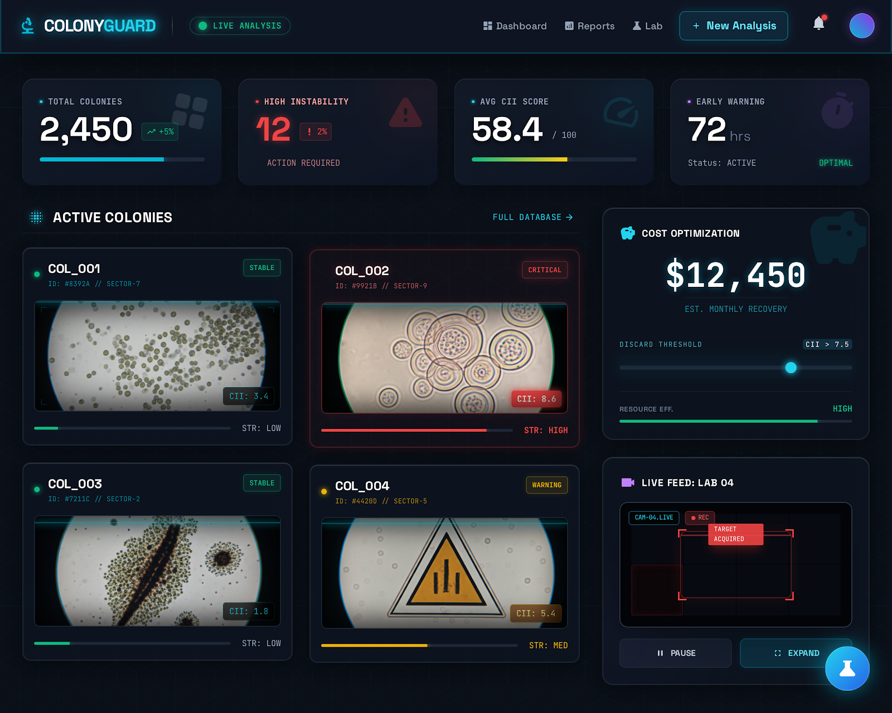
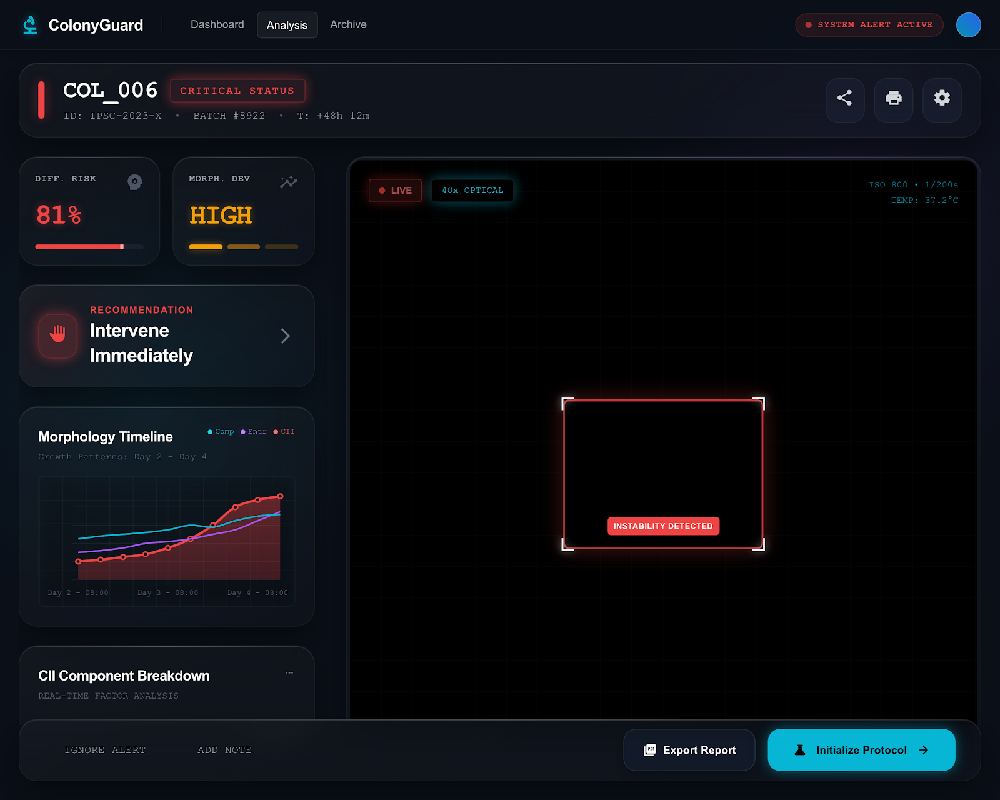
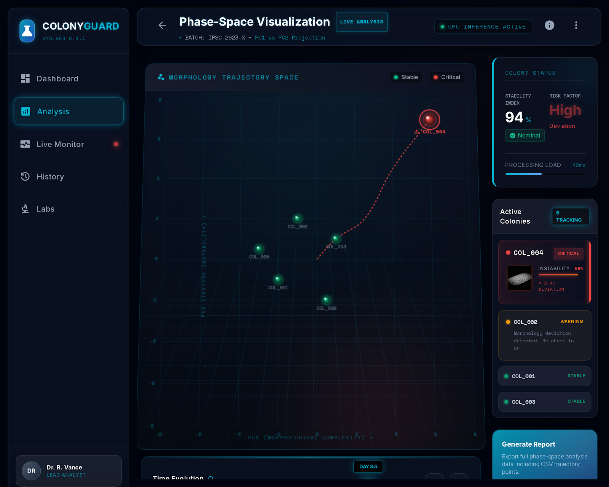
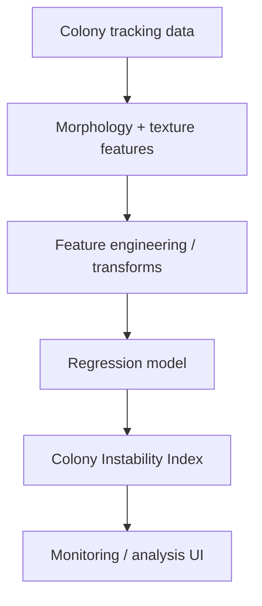

# ColonyGuard

**Experimental temporal ML system for monitoring iPSC colony morphology and surfacing instability signals from longitudinal culture data.**

ColonyGuard explores whether measurable changes in colony shape, texture, and image-derived morphology can be converted into a useful instability score for cell-culture monitoring.

> Research prototype — not a clinical, manufacturing, or diagnostic system.

## Interface snapshots

### Monitoring dashboard



### Detailed colony analysis



### Morphology trajectory space



## What is in this repository

- A Next.js interface for exploring colony-level data and model outputs.
- A sequence of Python experiments for feature engineering and regression.
- Morphology and texture features including diameter, area, perimeter, circularity, compactness, solidity, convexity, eccentricity, intensity statistics, entropy, contrast, homogeneity, energy, correlation, and edge density.
- Tabular iPSC colony-tracking data used by the experiments.
- A serialized experimental model artifact (`colony_model.pkl`).

## Modeling approach

The experiments treat the **Colony Instability Index** as a regression target and test multiple feature transformations and model configurations. The repository includes XGBoost-based experimentation, polynomial feature expansion, transformed targets, and repeated train/test splits.



## Why this project is interesting

Cell-culture monitoring is a temporal problem: a single image can look acceptable while the underlying trajectory is deteriorating. ColonyGuard was built around the idea that **trend-level morphology may be more informative than one-frame inspection**.

## Running the web app

```bash
npm install
npm run dev
```

Then open `http://localhost:3000`.

## Research notes

The repository contains exploratory model-selection scripts rather than a locked, independently validated benchmark. Any performance observed during repeated split search should be treated as experimental and **not** as an unbiased estimate of real-world predictive performance.

A stronger validation path would use:

- a fixed untouched holdout set;
- culture-level rather than row-level splitting where appropriate;
- prospective temporal validation;
- external data from a separate experiment or lab;
- pre-registered metrics and thresholds.

## Status

Prototype / research experiment. The main value of this repository is the pipeline design, feature work, modeling experiments, and the attempt to turn longitudinal colony morphology into a decision-support signal.